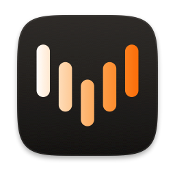

<div align="center">



<h1>Vocula</h1>

<p><b>Hold a key. Speak. The words appear where the caret is.</b><br>
Dictation for macOS that runs entirely on your Mac, in any of 100 languages.</p>

[](LICENSE)

[](https://github.com/vitaly-kashtalyan/vocula/releases/latest)
[](https://github.com/vitaly-kashtalyan/vocula/actions/workflows/ci.yml)

<a href="#install">Install</a> ·
<a href="#what-leaves-this-mac">Privacy</a> ·
<a href="#build-it-yourself">Build it yourself</a> ·
<a href="#known-limitations">Limitations</a> ·
<a href="PRIVACY.md">PRIVACY.md</a>

</div>

<!-- A screen recording of one dictation goes here, once there is one to record:
     hold the key, speak a sentence, watch it land in a text field. -->

There is no account, no sign-in, and no network connection of any kind after the
one-time model download — including for checking a licence.

## How it works

Hold <kbd>fn</kbd>, speak, release. The text is pasted at the caret, in whatever
application you were already typing in.

- Release inside 300 ms and the recording is discarded, so a brushed key costs
  nothing.
- <kbd>esc</kbd> cancels an open recording.
- <kbd>⌃</kbd><kbd>⇧</kbd><kbd>L</kbd> steps through the languages you selected,
  without opening a window.

That is the whole interface. There is no toggle mode and no double tap, because
one gesture that always works beats two where one sometimes does.

```
   you hold the key
          │
   [ AUHAL input ]        pinned to YOUR chosen device, not the system default
          │
   [ Silero VAD ]         CPU — finds where the speech is, or salvages a whisper
          │
   [ whisper.cpp ]        Metal GPU — 0.02–0.03× realtime, measured
          │
   [ TextFilter ]         drops output that is nothing but *[Music]* tags
          │
   [ TargetGuard ]        refuses password fields, and secure input raised mid-session
          │
   [ ⌘V ]                 your clipboard is put back a second later
          │
   the text is in your document
```

There is no network stage in that diagram, and that is the point.

## What leaves this Mac

Nothing you say. Ever.

| What | Where it happens |
| --- | --- |
| Audio capture | This Mac. The microphone opens on the record key and closes on release. |
| Speech detection and transcription | This Mac, on the GPU. |
| Dictation history | This Mac, AES-GCM encrypted, one file per day, kept a year. The key is in your login keychain. |
| Licence check | This Mac. An Ed25519 signature against a public key compiled into the binary. |
| Model download | Hugging Face, once, on first run. SHA-256 verified. |

**Do not take that on trust — the repository is open in front of you.** Every
network call in the shipping app is in one file, and this is the command that
proves it:

```sh
grep -rl "URLSession" App/Vocula Sources
# App/Vocula/Models/ModelDownloader.swift
```

No telemetry, no analytics, no crash reporting, no update check, no licence
server. The only third-party code in the app is whisper.cpp, pinned by URL and
SHA-256 in `Package.swift`, so there is no analytics SDK for a call to hide in.

The exceptions, stated rather than buried: Settings → Microphone opens the input
to draw a level meter, so you can see that it hears you before you rely on it —
macOS shows its orange dot for as long as it does, and the samples are measured
and dropped. Insertion goes through the system pasteboard for about a second,
which other applications can read. Both are in [PRIVACY.md](PRIVACY.md), at
length, along with what none of this protects you from.

## Install

Download the signed, notarised build from
[vocula.app](https://vocula.app), or [build it yourself](#build-it-yourself).
Both are the same program.

## Buying a build

The source builds into a working app. Nothing is held back, there is no reduced
edition, and the licence check is in this repository like everything else —
`LicenceVerifier` and the trial that gates it are a few files you can read, and
delete.

What the paid build is, exactly: this source, compiled once, signed with a
Developer ID certificate and notarised by Apple.

Whether that is worth paying for is your call, but the difference is measurable
rather than a matter of taste. macOS binds Accessibility and Microphone to a
bundle id **and its signature**, and the encrypted history key is ACL'd to the
same signature. An ad-hoc signature changes on every build.

> [!IMPORTANT]
> A copy you compile yourself is signed ad-hoc, so macOS asks for both
> permissions again every time you rebuild it, and the history key does not
> survive a rebuild. Point `App/Local.xcconfig` at your own Apple team to stop
> that.

Building it yourself is free, and of course always will be.
`App/Signing.xcconfig` ships ad-hoc by default precisely so that a stranger with
no Apple account can clone this repository and get a running app.

A build from source runs unlimited for seven days, then ten inserted dictations
a day until a key is pasted into Settings → Licence. A dictation only counts
against that if the text actually reached your caret: a cancelled gesture, a
silent recording, a refusal and a dead microphone all cost nothing.

## Requirements

- macOS 26.0 or later.
- About 1.6 GB of disk for the models — Large v3 Turbo, plus the voice-activity
  detector — downloaded once on first run.
- Two permissions, each asked for when it is first needed: **Accessibility**,
  which is what lets the record key be seen and swallowed outside our own
  window and lets ⌘V reach another application, and **Microphone**.

Apple Silicon is what it is developed and measured on. Both architectures build
and the framework ships an Intel slice, but nothing about Intel has been
measured — see [Known limitations](#known-limitations).

## Build it yourself

Xcode 26 or later — the package needs the Swift 6.2 toolchain and the macOS 26
SDK. The first build needs a network: the whisper.cpp XCFramework is fetched
from its GitHub release and checked against the SHA-256 pinned in
`Package.swift`.

```sh
brew install xcodegen                       # once
(cd App && xcodegen generate)               # required on a fresh clone
xcodebuild -project App/Vocula.xcodeproj -scheme Vocula -configuration Debug build
```

Hooks are tracked but not installed by cloning — `git config core.hooksPath .githooks`
turns them on. They format Swift and refuse a String Catalog that some other JSON
tool has rewritten. Skipping this costs nothing: CI runs the same checks.

`App/Vocula.xcodeproj` is generated and is not in the tree, so the second line is
not optional. Signing is ad-hoc by default; point `App/Local.xcconfig` at your
own team to get a stable signature — see `App/Local.xcconfig.example`.

`./scripts/install-local.sh` builds a Debug copy and installs it into
`/Applications`, in the order that avoids leaving a running app's pages under a
replaced bundle.

### Tests

```sh
swift test                       # VoculaKit and VoculaWhisper — no app, no hardware
./scripts/check-purity.sh        # VoculaKit must import Foundation only
./scripts/check-localization.sh  # every key has a translator comment
xcodebuild test -project App/Vocula.xcodeproj -scheme Vocula \
  -only-testing:VoculaAppTests
```

831 tests: 645 in the kit, 173 in the hosted app bundle, 13 driving the real
interface. The UI tests are opt-in with `TEST_RUNNER_VOCULA_UI_TESTS=1` because
they take over the screen, and `TEST_RUNNER_VOCULA_UI_LANG=de` runs the same
suite against a translated interface, which is the run that catches layout.

`swift test` never compiles `App/`, so a green run says nothing about whether the
app builds.

## Known limitations

Stated here rather than discovered later.

- **A licence cannot be revoked individually.** Verification is offline, so
  there is no server to ask — which is the whole point, and the cost is that a
  refund leaves a working key.
- **Insertion into a terminal executes what was said.** Nothing in the design
  prevents this.
- **Word counts split on whitespace**, which is honest for the languages this
  has been measured in and wrong for Chinese.
- **The interface is translated into nine languages and reviewed in one.**
  English is the source; German, Spanish, French, Italian, Polish, Portuguese
  (Brazil), Russian and Ukrainian are complete drafts waiting on a native
  reader. Correcting one is the single most useful thing you could send.

## Where things are

| Path | What lives there |
| --- | --- |
| `Sources/VoculaKit` | Every decision. Foundation only, enforced by a script. All of it tested. |
| `Sources/VoculaWhisper` | Adapters over the pinned whisper.cpp XCFramework. |
| `App/` | Event taps, audio, Accessibility, pasteboard, UI. |

Most of `App/` has no fast automated tests by design: it touches hardware. When
something breaks there, the fix is usually to move the *decision* into
`VoculaKit` and test it. Most of what lives in the kit arrived that way.

## Open source, but not open contribution

Pull requests are not accepted, and that is a policy rather than a backlog: a
merged patch leaves its author's copyright in the tree, which ends any
possibility of relicensing work whose binary is sold. A fork-and-close workflow
would be dishonest about that, so it is said here, before anyone does the work.

What is genuinely wanted: bug reports, measurements that contradict something
this README claims, a correction to one of the eight unreviewed translations,
and anything about a language. Open an issue.

Forking is free and needs no permission. Your fork stays GPL-3.0.
Security problems go through [SECURITY.md](SECURITY.md), not a public issue.

## Licence

Copyright © 2026 Vitali Kashtalyan.

Vocula is free software: you may redistribute it and modify it under the terms
of the **GNU General Public License, version 3**, as published by the Free
Software Foundation. It is distributed in the hope that it will be useful, but
WITHOUT ANY WARRANTY — without even the implied warranty of MERCHANTABILITY or
FITNESS FOR A PARTICULAR PURPOSE. The full text is in [LICENSE](LICENSE), and
a copy travels inside every build.

There are no per-file copyright headers, deliberately. The licence is stated
here and in `LICENSE`, which is what makes it binding; 220 files of boilerplate
would add nothing legally and would contradict the rule this codebase is built
on, that a comment must earn its place.

The third-party components Vocula is built on carry their own licences, which
are reproduced in full in `App/Vocula/Licenses/THIRD-PARTY.txt` and are
reachable from Settings → Models inside the app.
